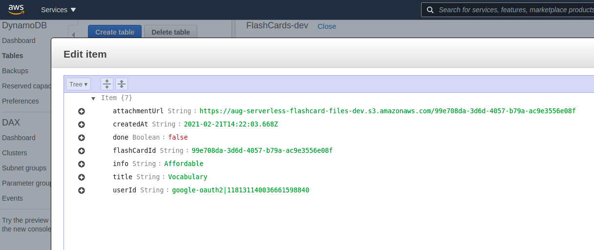
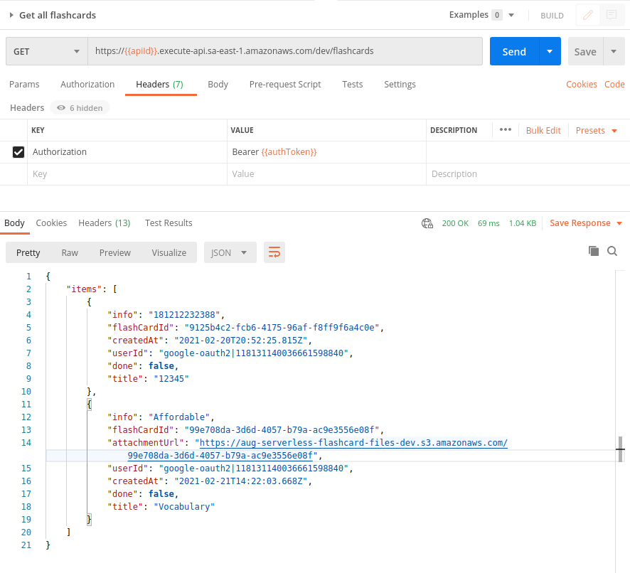
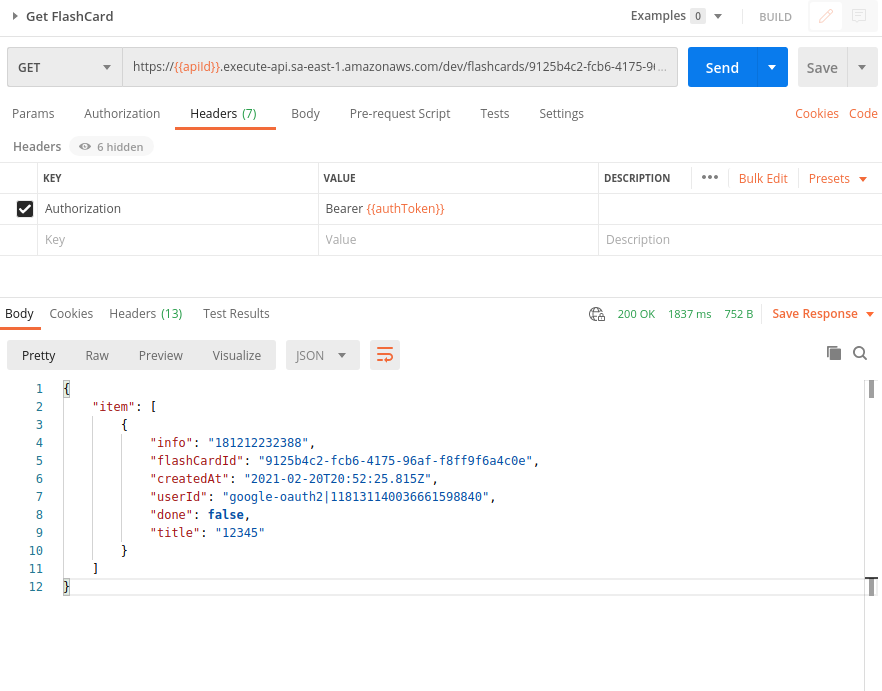
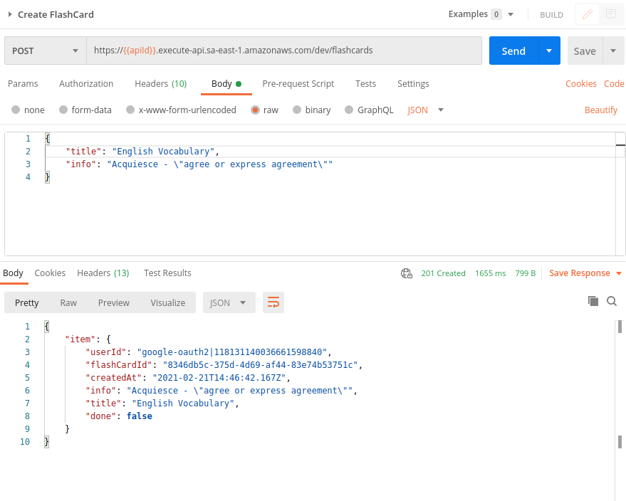
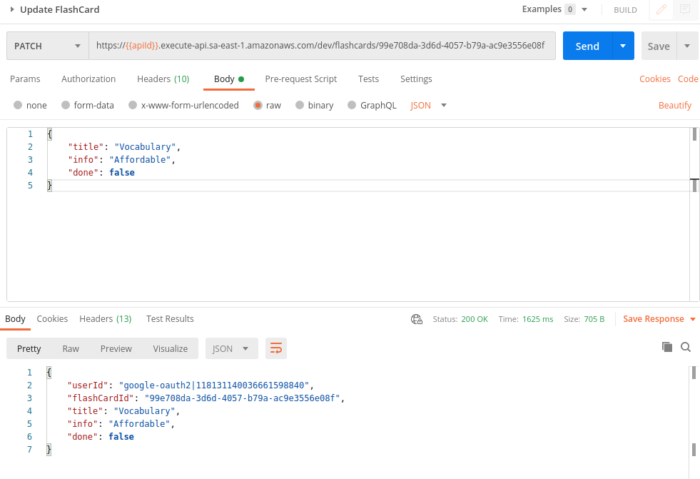
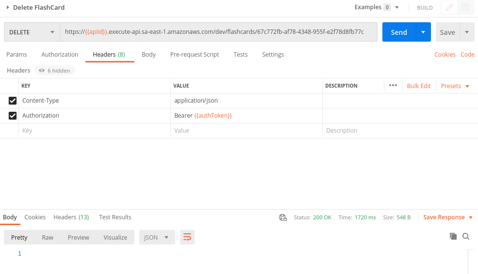
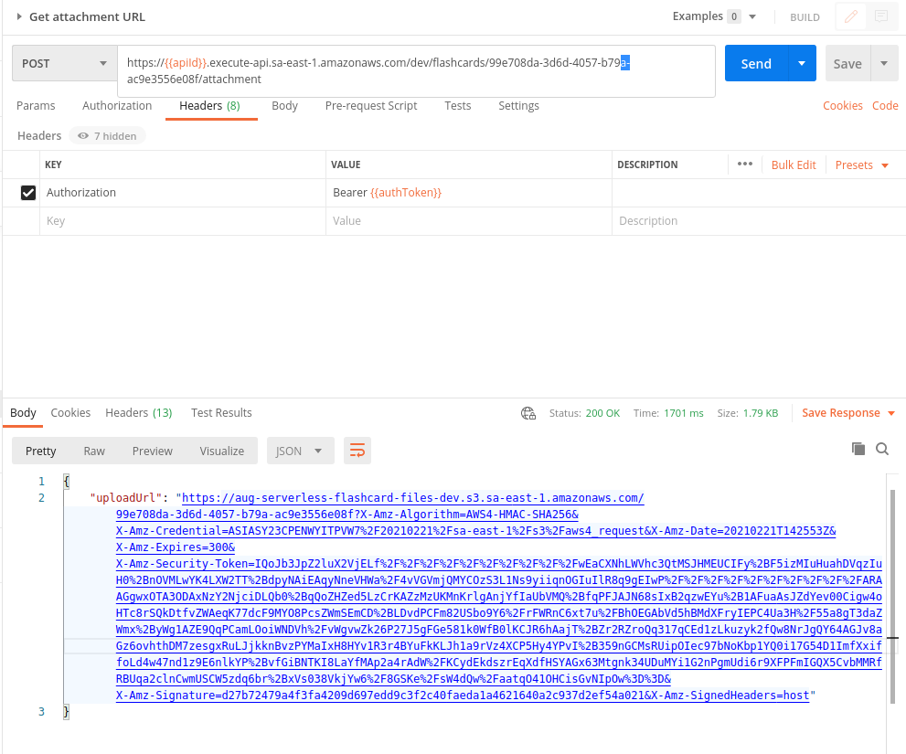
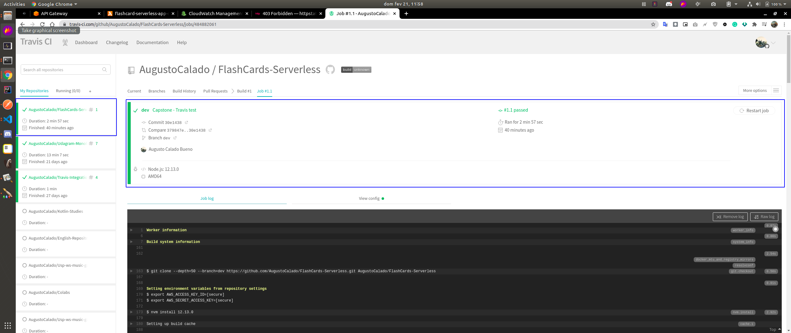

# FlashCard - Serverless App
The goal of this project is to build and deploy a serverless application on AWS. In order to accomplish this task, I have choosen to build a "FlashCard" App with a React frontend and a Node.JS backend using a Serverless-Framework.

## CloudFormation Template to deploy:
- API gateway
- Lambda Functions with proper IAM permissions
- 2 DynamoDB tables to store records of Users and Their FlashCard
- S3 bucket to store images uploaded by Users and linked with FlashCards


## Authentification system
This project is also using a fully secured Authentification system through Auth0.

## Functionality of the application
This application was built with the objective of helping students in their studies, enabling them to register and store useful information in flashcard format. In addition, a feature was introduced making possible to attach images to cards.

## How to Connect Local Front-end with the backend server already deployed in AWS
A version of this website is already running on []. To run this application locally follow these instructions:

```
Update the callbackUrl on the client/config.ts file
export const authConfig = {
  ...        
  callbackUrl: 'https://localhost:3000/callback'
}
```
and run the following commands:

```
cd client
npm install
npm run start
The frontend will be running on http://localhost:3000/
```

## About the DB structure
### Database tables
The backend is using DynamoDB databases provisioned on the serverless file by AWS.

**FLASHCARD items**
The application store FLASHCARD items, and each FLASHCARD item contains the following fields:

- flashCardId (string) - a unique id for an item
- userId (string) - the user id that created this flashcard item
- timestamp (string) - date and time when an item was created
- title (String) - the flashcard's title
- info (String) - the flashcard's body
- done (boolean) -  boolean variable to indicate to the system if the card is to be displayed (remembered) or not.
- attachmentUrl (string) (optional) - a URL pointing to an image attached to a flashcard item



## API endpoints
### Authentification
`Auth` - this function implement a custom authorizer for API Gateway that has been added to all other functions.

###  FlashCards API
- `Get all Flashcards` - return all FlashCards for a given user . A user id can be extracted from a JWT token that is sent by the frontend.
  

- `Get FlashCard` - return a single FlashCard item by flashCardId. (PS: Using Header with **Key** `Authorization` and **Value** `Bearer <token>` ).
  

- `Create FlashCard` - create a new FlashCard for a given user. The format of the request body that should be send by a client application to this function can be found in the requests/FlashCardItem.ts file
  

- `Update FlashCard` -  update a FlashCard item with a new `title` or `info` or `done` (used to decide if the card should be shown or not) 
  

- `Delete FlashCard` - delete a FlashCard item created by a current user. Expects an id of a FlashCard item to remove.
  

- `Generate UploadUrl` - it is used to add a picture to a FlashCard item.
  
  
  The pre-signed URL is used to upload an attachment file to a s3 bucket for a FlashCard item. It then updates the FlashCard item with an attachmentUrl key that has the URL of s3 bucket of the uploaded image {attachmentUrl: "https://${bucketName}.s3.amazonaws.com/${flashCardId}"}

## Test
To test the endpoints of this application download the postman collection: FlashCards-Serverless-App.postman_collection.json

## CI/CD pipeline
Travis was used to automically deploy and update the application. Each time a new commit is pushed to the master branch, a new build is triggered. A commit pushed to the development branch won't trigger a new deployment, which allows to integrate changes without affecting the production environment.
